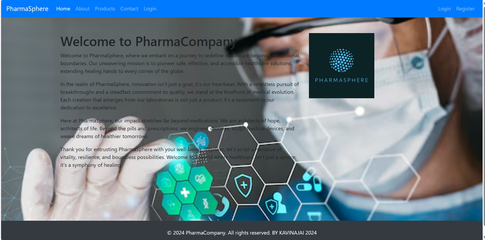

# Project Responsive Web Design using Bootstrap
## Date: 10.05.2024

## AIM:
To design a responsive website for a Pharmaceutical Company using Bootstrap.


## DESIGN STEPS:

### Step 1:
Clone the repository from GitHub.

### Step 2:
Create Django Admin project.

### Step 3:
Create a New App under the Django Admin project.

### Step 4:
Insert the necessary CSS and JavaScript files as external in order to use Bootstrap.

### Step 5:
Create a HTML file and include the needed Bootstrap components.

### Step 6:
Publish the website in the LocalHost.

## PROGRAM :
web.html
```
<!DOCTYPE html>
<html lang="en">
<head>
  <meta charset="UTF-8">
  <meta name="viewport" content="width=device-width, initial-scale=1.0">
  <title>Home - PharmaCompany</title>
  <!-- Bootstrap CSS -->
  <link href="https://stackpath.bootstrapcdn.com/bootstrap/4.5.2/css/bootstrap.min.css" rel="stylesheet">
</head>
<body>

  <!-- Navbar -->
  <nav class="navbar navbar-expand-lg navbar-dark bg-primary">
    <a class="navbar-brand" href="#">PharmaSphere</a>
    <button class="navbar-toggler" type="button" data-toggle="collapse" data-target="#navbarSupportedContent" aria-controls="navbarSupportedContent" aria-expanded="false" aria-label="Toggle navigation">
      <span class="navbar-toggler-icon"></span>
    </button>

    <div class="collapse navbar-collapse" id="navbarSupportedContent">
      <ul class="navbar-nav mr-auto">
        <li class="nav-item active">
          <a class="nav-link" href="web.html">Home <span class="sr-only">(current)</span></a>
        </li>
        <li class="nav-item">
          <a class="nav-link" href="about.html">About</a>
        </li>
        <li class="nav-item">
          <a class="nav-link" href="product.html">Products</a>
        </li>
        <li class="nav-item">
          <a class="nav-link" href="contact.html">Contact</a>
        </li>
        <li class="nav-item">
          <a class="nav-link" href="login.html">Login</a>
        </li>
      </ul>
      <ul class="navbar-nav ml-auto">
        <li class="nav-item">
          <a class="nav-link" href="#">Login</a>
        </li>
        <li class="nav-item">
          <a class="nav-link" href="#">Register</a>
        </li>
      </ul>
    </div>
  </nav>

  <!-- Page Content -->
  <div class="container mt-5">
    <div class="row">
      <div class="col-md-8">
        <h1>Welcome to PharmaCompany</h1>
        <p>Welcome to PharmaSphere, where we embark on a journey to redefine healthcare beyond conventional boundaries. Our unwavering mission is to pioneer safe, effective, and accessible healthcare solutions, extending healing hands to every corner of the globe.</p>
<p>In the realm of PharmaSphere, innovation isn't just a goal; it's our heartbeat. With a relentless pursuit of breakthroughs and a steadfast commitment to quality, we stand at the forefront of medical evolution. Each creation that emerges from our laboratories is not just a product; it's a testament to our dedication to excellence.</p>
<p>Here at PharmaSphere, our impact stretches far beyond medications. We are architects of hope, architects of life. Beyond the pills and prescriptions, we engineer vaccines, sculpt medical devices, and weave dreams of healthier tomorrows.</p>
<p>Thank you for entrusting PharmaSphere with your well-being. Together, let's script a narrative of vitality, resilience, and boundless possibilities. Welcome to a world where healthcare isn't just a service; it's a symphony of healing.</p>
      </div>
      <div class="col-md-4">
        
      </div>
    </div>
  </div>
  <body background="medical-banner-with-doctor-wearing-goggles_23-2149611193.avif" style="background-repeat: no-repeat; background-size: cover;">
  <br>
  <br>
  <br>
  <br>

  <!-- Footer -->
  <footer class="bg-dark text-white text-center py-4 mt-5">
    <p>&copy; 2024 PharmaCompany. All rights reserved. BY KAVINAJAI 2024</p>
  </footer>

  <!-- Bootstrap JS -->
  <script src="https://code.jquery.com/jquery-3.5.1.slim.min.js"></script>
  <script src="https://cdn.jsdelivr.net/npm/popper.js@1.16.1/dist/umd/popper.min.js"></script>
  <script src="https://stackpath.bootstrapcdn.com/bootstrap/4.5.2/js/bootstrap.min.js"></script>
</body>
</html>
```
login.html
```
<!DOCTYPE html>
<html lang="en">
<head>
  <meta charset="UTF-8">
  <meta name="viewport" content="width=device-width, initial-scale=1.0">
  <title>Login - PharmaCompany</title>
  <!-- Bootstrap CSS -->
  <link href="https://stackpath.bootstrapcdn.com/bootstrap/4.5.2/css/bootstrap.min.css" rel="stylesheet">
</head>
<body>

  <!-- Navbar -->
  <nav class="navbar navbar-expand-lg navbar-dark bg-primary">
    <a class="navbar-brand" href="#">PharmaSphere</a>
    <button class="navbar-toggler" type="button" data-toggle="collapse" data-target="#navbarSupportedContent" aria-controls="navbarSupportedContent" aria-expanded="false" aria-label="Toggle navigation">
      <span class="navbar-toggler-icon"></span>
    </button>

    <div class="collapse navbar-collapse" id="navbarSupportedContent">
      <ul class="navbar-nav mr-auto">
        <li class="nav-item">
          <a class="nav-link" href="web.html">Home</a>
        </li>
        <li class="nav-item">
          <a class="nav-link" href="about.html">About</a>
        </li>
        <li class="nav-item">
          <a class="nav-link" href="product.html">Products</a>
        </li>
        <li class="nav-item">
          <a class="nav-link" href="contact.html">Contact</a>
        </li>
      </ul>
      <ul class="navbar-nav ml-auto">
        <li class="nav-item">
          <a class="nav-link" href="login.html">Login</a>
        </li>
        <li class="nav-item">
          <a class="nav-link" href="#">Register</a>
        </li>
      </ul>
    </div>
  </nav>

  <!-- Login Form -->
  <div class="container mt-5">
    <div class="row justify-content-center">
      <div class="col-md-6">
        <h2 class="mb-4">Login to Your Account</h2>
        <form>
          <div class="form-group">
            <label for="email">Email address</label>
            <input type="email" class="form-control" id="email" aria-describedby="emailHelp" placeholder="Enter email">
          </div>
          <div class="form-group">
            <label for="password">Password</label>
            <input type="password" class="form-control" id="password" placeholder="Password">
          </div>
          <button type="submit" class="btn btn-primary">Login</button>
        </form>
      </div>
    </div>
  </div>

  <!-- Footer -->
  <footer class="bg-dark text-white text-center py-4 mt-5">
    <p>&copy; 2024 PharmaCompany. All rights reserved. BY KAVINAJAI 2024</p>
  </footer>

  <!-- Bootstrap JS -->
  <script src="https://code.jquery.com/jquery-3.5.1.slim.min.js"></script>
  <script src="https://cdn.jsdelivr.net/npm/popper.js@1.16.1/dist/umd/popper.min.js"></script>
  <script src="https://stackpath.bootstrapcdn.com/bootstrap/4.5.2/js/bootstrap.min.js"></script>
</body>
</html>
```
about.html
```
<!DOCTYPE html>
<html lang="en">
<head>
  <meta charset="UTF-8">
  <meta name="viewport" content="width=device-width, initial-scale=1.0">
  <title>About PharmaCompany</title>
  <!-- Bootstrap CSS -->
  <link href="https://stackpath.bootstrapcdn.com/bootstrap/4.5.2/css/bootstrap.min.css" rel="stylesheet">
</head>
<body>

  <!-- Navbar -->
  <nav class="navbar navbar-expand-lg navbar-dark bg-primary">
    <a class="navbar-brand" href="#">PharmaCompany</a>
    <button class="navbar-toggler" type="button" data-toggle="collapse" data-target="#navbarSupportedContent" aria-controls="navbarSupportedContent" aria-expanded="false" aria-label="Toggle navigation">
      <span class="navbar-toggler-icon"></span>
    </button>

    <div class="collapse navbar-collapse" id="navbarSupportedContent">
      <ul class="navbar-nav mr-auto">
        <li class="nav-item">
          <a class="nav-link" href="web.html">Home</a>
        </li>
        <li class="nav-item">
          <a class="nav-link" href="about.html">About</a>
        </li>
        <li class="nav-item">
          <a class="nav-link" href="product.html">Products</a>
        </li>
        <li class="nav-item">
          <a class="nav-link" href="#">Contact</a>
        </li>
      </ul>
    </div>
  </nav>

  <!-- Page Content -->
  <div class="container mt-5">
    <div class="row">
      <div class="col-md-12">
        <h1>Welcome to PharmaSphere</h1>
        <div id="vision">
          <h2>Our Vision</h2>
          <p>At PharmaSphere, we envision leading the pharmaceutical landscape in India and beyond, pioneering transformative solutions that are not only high-quality and affordable but also innovative, redefining standards in medicine and treatment worldwide.</p>
        </div>
        <div id="mission">
          <h2>Our Mission</h2>
          <p>Our unwavering mission at PharmaSphere is to embark on a journey of discovery, development, and global impact. We strive to uncover, develop, and bring to market pharmaceutical products that not only prevent, diagnose, and alleviate diseases but also pave the way for a healthier tomorrow.</p>
        </div>
        <div id="values">
          <h2>Our Values</h2>
          <ul>
            <li><strong>Quality:</strong> Quality is not just a virtue; it's our lifeline. At PharmaSphere, we are dedicated to meticulously crafting high-quality products that resonate with excellence, setting new benchmarks in the pharmaceutical arena.</li>
            
            <li><strong>Commitment to Excellence:</strong> Our relentless pursuit of excellence fuels our journey towards greatness. We are committed to surpassing expectations and delivering products that epitomize the pinnacle of quality and innovation.</li>
            
            <li><strong>Customer-Centric:</strong> Our compass points towards our customers' needs. Embracing a customer-centric approach, we aim to revolutionize the pharmaceutical landscape by offering seamless access to top-notch products through digital channels.</li>
            
            <li><strong>Collaborative Spirit:</strong> We firmly believe in the power of collaboration. At PharmaSphere, teamwork isn't just a concept; it's the driving force behind our collective success. Together, we turn aspirations into achievements.</li>
          </ul>
        </div>
      </div>
    </div>
</div>

          </ul>
        </div>
        <br>
        <!-- Add more subheadings as needed -->
      </div>
    </div>
  </div>
  <body background="medical-banner-with-doctor-wearing-goggles_23-2149611193.avif" style="background-repeat: no-repeat; background-size: cover;"></body>
  <!-- Footer -->
  <footer class="bg-dark text-white text-center py-4 mt-3">
    <p>&copy; 2024 PharmaCompany. All rights reserved.  BY KAVINAJAI@2024</p>
  </footer>

  <!-- Bootstrap JS -->
  <script src="https://code.jquery.com/jquery-3.5.1.slim.min.js"></script>
  <script src="https://cdn.jsdelivr.net/npm/popper.js@1.16.1/dist/umd/popper.min.js"></script>
  <script src="https://stackpath.bootstrapcdn.com/bootstrap/4.5.2/js/bootstrap.min.js"></script>
</body>
</html>
```
product.html
```
<!DOCTYPE html>
<html lang="en">
<head>
  <meta charset="UTF-8">
  <meta name="viewport" content="width=device-width, initial-scale=1.0">
  <title>Products - PharmaCompany</title>
  <!-- Bootstrap CSS -->
  <link href="https://stackpath.bootstrapcdn.com/bootstrap/4.5.2/css/bootstrap.min.css" rel="stylesheet">
</head>
<body>

  <!-- Navbar -->
  <nav class="navbar navbar-expand-lg navbar-dark bg-primary">
    <a class="navbar-brand" href="#">PharmaCompany</a>
    <button class="navbar-toggler" type="button" data-toggle="collapse" data-target="#navbarSupportedContent" aria-controls="navbarSupportedContent" aria-expanded="false" aria-label="Toggle navigation">
      <span class="navbar-toggler-icon"></span>
    </button>
    <div class="collapse navbar-collapse" id="navbarSupportedContent">
      <ul class="navbar-nav mr-auto">
        <li class="nav-item">
          <a class="nav-link" href="web.html">Home</a>
        </li>
        <li class="nav-item">
          <a class="nav-link" href="about.html">About</a>
        </li>
        <li class="nav-item dropdown">
          <a class="nav-link dropdown-toggle" href="#" id="navbarDropdown" role="button" data-toggle="dropdown" aria-haspopup="true" aria-expanded="false">
            Products
          </a>
          <div class="dropdown-menu" aria-labelledby="navbarDropdown">
            <a class="dropdown-item" href="#">Over-the-counter (OTC) Medications</a>
            <a class="dropdown-item" href="#">Prescription Drugs</a>
            <a class="dropdown-item" href="#">Vaccines</a>
            <a class="dropdown-item" href="#">Supplements</a>
          </div>
        </li>
        <li class="nav-item active">
          <a class="nav-link" href="contact.html">Contact</a>
        </li>
      </ul>
      <ul class="navbar-nav ml-auto">
        <li class="nav-item">
          <a class="nav-link" href="#">Login</a>
        </li>
        <li class="nav-item">
          <a class="nav-link" href="#">Register</a>
        </li>
      </ul>
    </div>
  </nav>

  <!-- Page Content -->
  <div class="container mt-3">
    <div class="row">
      <div class="col-md-12">
        <h1>Explore Our Product Categories</h1>
        <div class="card-deck">
          <div class="card">
            
            <div class="card-body">
              <h5 class="card-title">Over-the-counter (OTC) Medications</h5>
              <p class="card-text">Discover our range of OTC medications designed to alleviate common ailments such as aches, pains, and itches, available without a prescription.</p>
              <a href="#" class="btn btn-primary">Explore Now</a>
            </div>
          </div>
          <div class="card">
            
            <div class="card-body">
              <h5 class="card-title">Prescription Drugs</h5>
              <p class="card-text">Explore our extensive collection of prescription drugs, meticulously crafted to address specific medical needs and dispensed only with a valid medical prescription.</p>
              <a href="#" class="btn btn-primary">Explore Now</a>
            </div>
          </div>
          <div class="card">
            
            <div class="card-body">
              <h5 class="card-title">Vaccines</h5>
              <p class="card-text">Discover our lineup of vaccines, meticulously developed to provide active acquired immunity against various infectious or malignant diseases, safeguarding your health and well-being.</p>
              <a href="#" class="btn btn-primary">Explore Now</a>
            </div>
          </div>
          <div class="card">
            
            <div class="card-body">
              <h5 class="card-title">Health Supplements</h5>
              <p class="card-text">Explore our range of health supplements, including vitamins, minerals, herbs, probiotics, and more, designed to support your overall health and well-being.</p>
              <a href="#" class="btn btn-primary">Explore Now</a>
            </div>
          </div>
        </div>
      </div>
    </div>
  </div>


  <!-- Footer -->
  <footer class="bg-dark text-white text-center py-4 mt-5">
    <p>&copy; 2024 PharmaCompany. All rights reserved. T.KAVINAJAI@2024</p>
  </footer>
  <body background="medical-banner-with-doctor-wearing-goggles_23-2149611193.avif" style="background-repeat: no-repeat; background-size: cover;">


  <!-- Bootstrap JS -->
  <script src="https://code.jquery.com/jquery-3.5.1.slim.min.js"></script>
  <script src="https://cdn.jsdelivr.net/npm/popper.js@1.16.1/dist/umd/popper.min.js"></script>
  <script src="https://stackpath.bootstrapcdn.com/bootstrap/4.5.2/js/bootstrap.min.js"></script>
</body>
</html>
```

## OUTPUT:



## RESULT:
The Project for responsive web design using Bootstrap is completed successfully.
